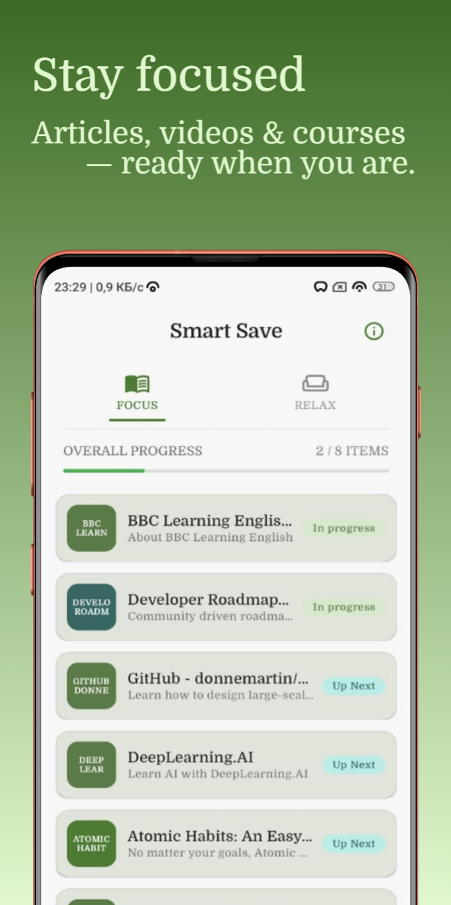
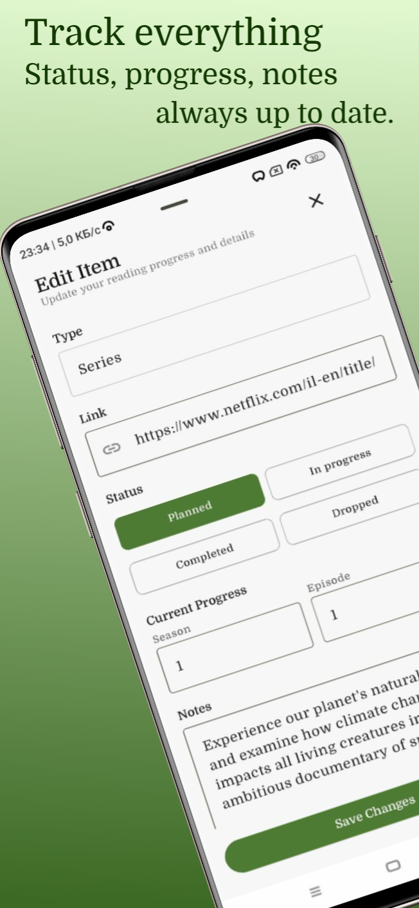

# Kiplet

Kiplet (formerly LaterBox) is a Kotlin Multiplatform app for saving things to watch or read later across Android, iOS, and Desktop.

**Website:** https://keatmur.github.io/kiplet/ · [Русская версия](https://keatmur.github.io/kiplet/ru.html)

 

## Download

Builds are published on [GitHub Releases](https://github.com/keatmur/kiplet/releases). The links below always point to the latest version.

| Platform | Download |
|---|---|
| Android (Google Play) | [group.byte.buddies.laterbox](https://play.google.com/store/apps/details?id=group.byte.buddies.laterbox) |
| Android (APK) | [Kiplet-android.apk](https://github.com/keatmur/kiplet/releases/latest/download/Kiplet-android.apk) |
| Windows (MSI, recommended) | [Kiplet-windows.msi](https://github.com/keatmur/kiplet/releases/latest/download/Kiplet-windows.msi) |
| Windows (EXE) | [Kiplet-windows.exe](https://github.com/keatmur/kiplet/releases/latest/download/Kiplet-windows.exe) |

Android: allow installing apps from unknown sources before opening the APK.
Windows: the installer is not code-signed yet, so SmartScreen may ask for confirmation ("More info" → "Run anyway").

## What It Does

- Save links to articles, videos, books, podcasts, movies, and series
- Parse page metadata automatically from the URL
- Classify content into meaningful content types
- Organize items by mode: `FOCUS` and `CHILL`
- Track progress for reading and watching
- Local-first storage, with cross-device sync planned

## Tech Stack

Kotlin Multiplatform · Compose Multiplatform · Material 3 · SQLDelight · Koin · Ktor Client · Ksoup

Targets: Android, iOS, Desktop (JVM).

## Architecture

Kiplet follows a clean layered structure:

- `presentation`: Compose UI, screens, and view models
- `domain`: business models and rules
- `data`: repositories, local persistence, and metadata parsing

Details: [docs/ARCHITECTURE.md](./docs/ARCHITECTURE.md). Diagrams: [domain model](./media/domain-model-diagram.png), [progress flow](./media/progress-flow-diagram.png).

## About This Repository

This public repository is the showcase and release hub for Kiplet. It contains:

- the landing page served by GitHub Pages (`index.html`, `ru.html`, `assets/`, `media/`); colors and the Domine font follow the app theme, screenshots are the Google Play store images
- architecture notes and diagrams
- release builds, attached to GitHub Releases (binaries are not committed to the repository)

The full production source code is kept in a private repository. The release process is described in [docs/PUBLISHING.md](./docs/PUBLISHING.md).

## Contact

For a walkthrough of the full implementation (for example, for an interview or code review), contact the repository owner.
